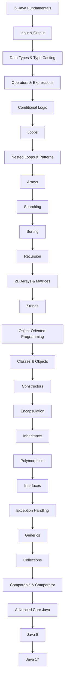
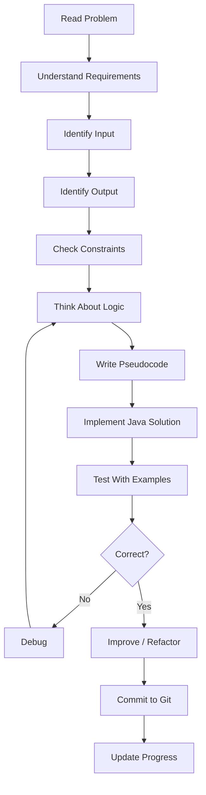

# ☕ Java Problem Solving
https://docs.google.com/spreadsheets/d/1iXK_J6m9ty9ydVWh4nvj1HXjKW5kEnsI-xNlNo8XszY/edit?gid=631844992#gid=631844992
A structured journey through Core Java, Java 8 and Java 17 with hands-on problem solving.


> This repository documents my journey of learning Java from fundamentals through Core Java, Java 8 and Java 17. Every topic is reinforced through practical coding problems and exercises.

---

## 📌 About This Repository

This repository is a personal, structured record of my Core Java learning journey. It is **not** a backend development repository — there is no Spring, Hibernate, JDBC, SQL, REST APIs, or database work here. That belongs to a separate repository.

This repository covers exactly one path:

```text
Core Java
   ↓
Java Problem Solving
   ↓
Advanced Core Java
   ↓
Java 8
   ↓
Java 17
```

---

## 🎯 Learning Goals

- Build a strong foundation in Core Java fundamentals, OOP, and problem solving.
- Practice searching, sorting, recursion, arrays, matrices, and strings until they're second nature.
- Get comfortable with exception handling, generics, and the Collections framework.
- Learn Java 8 (lambdas, functional interfaces, Streams, Optional) as a distinct, dedicated stage.
- Learn Java 17 (records, sealed classes, pattern matching, text blocks) as a distinct, dedicated stage.
- Keep an honest, up-to-date record of what's done, what's in progress, and what's still ahead.

---

## 🗺️ Java Learning Roadmap

```text
                    ☕ JAVA
                       │
                       ▼
              ┌─────────────────┐
              │   Core Java     │
              └─────────────────┘
                       │
        ┌──────────────┼──────────────┐
        ▼              ▼              ▼
   Fundamentals       OOP       Problem Solving
        │              │              │
        └──────────────┼──────────────┘
                       ▼
              Advanced Core Java
                       │
                       ▼
                  ☕ Java 8
                       │
                       ▼
                  🚀 Java 17
```

Full detail for each stage lives in its own roadmap document:

- [`docs/core-java-roadmap.md`](docs/core-java-roadmap.md)
- [`docs/java-8-roadmap.md`](docs/java-8-roadmap.md)
- [`docs/java-17-roadmap.md`](docs/java-17-roadmap.md)

### Master Learning Flowchart



---

## 📊 Current Progress

Every problem below is tracked individually in [`PROGRESS.md`](PROGRESS.md). Statuses are only updated once actual working code exists in `src/` — nothing here is marked done ahead of the real implementation.

| Stage | Topics | Problems | Status |
|---|---|---:|---|
| Core Java | 27 | 166 | 🚧 In Progress |
| Java 8 | 20 features | — | ⏳ Planned |
| Java 17 | 9 features | — | ⏳ Planned |

> **Note:** This README ships as a template alongside the supplied problem list. As problems are actually implemented and committed to `src/`, update the checkboxes and status columns in `PROGRESS.md`, the tables below, and the individual topic READMEs to reflect real progress — do not mark items complete in advance.

---

## 📚 Core Java Topics

Topic-wise breakdown of every Core Java problem in this repository, calculated directly from the supplied problem list — no estimates.

| # | Topic | Problems | Status |
|---:|---|---:|---|
| 01 | Java Basics & Input/Output | 6 | ⬜ |
| 02 | Operators & Expressions | 14 | ⬜ |
| 03 | if / else / Conditional Logic | 7 | ⬜ |
| 04 | Loops | 20 | ⬜ |
| 05 | Nested Loops & Patterns | 13 | ⬜ |
| 06 | Arrays: Fundamentals | 4 | ⬜ |
| 07 | Array Searching | 2 | ⬜ |
| 08 | Array Problem Solving | 9 | ⬜ |
| 09 | Sorting | 4 | ⬜ |
| 10 | Recursion | 2 | ⬜ |
| 11 | 2D Arrays / Matrices | 6 | ⬜ |
| 12 | String Basics | 12 | ⬜ |
| 13 | Command-Line Arguments | 1 | ⬜ |
| 14 | OOP: Class & Object | 4 | ⬜ |
| 15 | Encapsulation / Getters & Setters | 2 | ⬜ |
| 16 | Method Overloading | 1 | ⬜ |
| 17 | Method Overriding / Inheritance | 4 | ⬜ |
| 18 | Inheritance + Business Example | 1 | ⬜ |
| 19 | Interfaces | 5 | ⬜ |
| 20 | final | 5 | ⬜ |
| 21 | Exception Handling | 10 | ⬜ |
| 22 | Generics | 5 | ⬜ |
| 23 | Collections: ArrayList / LinkedList | 7 | ⬜ |
| 24 | Set / HashSet | 5 | ⬜ |
| 25 | Map / HashMap | 9 | ⬜ |
| 26 | Comparable & Comparator | 3 | ⬜ |
| 27 | More Collection Practice | 5 | ⬜ |
| 28 | Java 8 (all subtopics) | — | ⬜ |
| 29 | Java 17 (all subtopics) | — | ⬜ |
| **Total** | **27 Core Java topics** | **166** | — |

See [`docs/core-java-roadmap.md`](docs/core-java-roadmap.md) for the full concept-level roadmap (including topics not yet backed by a problem set).

---

## 🧩 Problems Solved

The complete, problem-by-problem tracker (all 166 Core Java problems) lives in [`PROGRESS.md`](PROGRESS.md). It is the single source of truth for what has actually been solved.

Legend:

- ✅ Completed — working, tested solution committed to `src/`
- 🚧 In Progress — actively being worked on
- ⬜ Not Started — not yet attempted
- ⏳ Planned — scoped for a later stage (mainly used for Java 8 / Java 17 features)

---

## 🧠 Problem-Solving Approach



---

## ☕ Java 8

A completely separate stage from Core Java — covered only after the Core Java roadmap is solid.

```text
☕ Java 8
│
├── Lambda Expressions
├── Functional Interfaces
├── Predicate / Consumer / Supplier / Function
├── BiPredicate / BiConsumer / BiFunction
├── Method References
├── Constructor References
├── Stream API (filter, map, flatMap, sorted, distinct, limit, skip, reduce, collect, forEach)
├── Collectors
├── Optional
├── Default & Static Interface Methods
├── Date & Time API
└── Java 8 Problem Solving
```

Full breakdown and status: [`docs/java-8-roadmap.md`](docs/java-8-roadmap.md). Nothing in this stage is marked complete yet.

---

## 🚀 Java 17

A completely separate stage from Java 8 — covered last.

```text
🚀 Java 17
│
├── Modern Java Syntax
├── Records
├── Sealed Classes
├── Pattern Matching for instanceof
├── Switch Expressions
├── Text Blocks
├── Enhanced Language Features
├── Helpful NullPointerExceptions
└── Java 17 Problem Solving
```

Full breakdown and status: [`docs/java-17-roadmap.md`](docs/java-17-roadmap.md). Nothing in this stage is marked complete yet.

---

## 📂 Repository Structure

```text
Java-Problem-Solving/
│
├── README.md
├── ROADMAP.md
├── PROGRESS.md
│
├── docs/
│   ├── core-java-roadmap.md
│   ├── java-8-roadmap.md
│   ├── java-17-roadmap.md
│   └── diagrams/
│
├── src/
│   ├── 01_JavaBasics/
│   ├── 02_Operators/
│   ├── 03_ConditionalLogic/
│   ├── 04_Loops/
│   ├── 05_Patterns/
│   ├── 06_ArraysFundamentals/
│   ├── 07_ArraySearching/
│   ├── 08_ArrayProblemSolving/
│   ├── 09_Sorting/
│   ├── 10_Recursion/
│   ├── 11_MatricesAnd2DArrays/
│   ├── 12_Strings/
│   ├── 13_CommandLineArguments/
│   ├── 14_OOP_ClassAndObject/
│   ├── 15_Encapsulation/
│   ├── 16_MethodOverloading/
│   ├── 17_MethodOverridingInheritance/
│   ├── 18_InheritanceBusinessExample/
│   ├── 19_Interfaces/
│   ├── 20_FinalKeyword/
│   ├── 21_ExceptionHandling/
│   ├── 22_Generics/
│   ├── 23_Collections_ArrayList_LinkedList/
│   ├── 24_Set_HashSet/
│   ├── 25_Map_HashMap/
│   ├── 26_ComparableComparator/
│   ├── 27_MoreCollectionPractice/
│   │
│   ├── Java8/
│   └── Java17/
│
└── resources/
```

Each topic folder gets its own `README.md` once problems are added to it (see `docs/core-java-roadmap.md` for the expected structure).

---

## 🔄 Git Workflow

```text
Choose Problem
      ↓
Understand Problem
      ↓
Write Solution
      ↓
Run Program
      ↓
Test
      ↓
Debug
      ↓
git add .
      ↓
git commit
      ↓
git push
      ↓
Update Progress
```

```bash
git add .
git commit -m "Add Celsius to Fahrenheit"
git push origin main
```

Commit message style:

```text
Add <problem>
Solve <problem>
Implement <topic>
Complete <topic>
Add Java 8 <feature>
Add Java 17 <feature>
```

---

## 📈 Progress Tracking

- [ ] Java Basics & Input/Output (0/6)
- [ ] Operators & Expressions (0/14)
- [ ] Conditional Logic (0/7)
- [ ] Loops (0/20)
- [ ] Patterns (0/13)
- [ ] Arrays: Fundamentals (0/4)
- [ ] Array Searching (0/2)
- [ ] Array Problem Solving (0/9)
- [ ] Sorting (0/4)
- [ ] Recursion (0/2)
- [ ] 2D Arrays / Matrices (0/6)
- [ ] String Basics (0/12)
- [ ] Command-Line Arguments (0/1)
- [ ] OOP: Class & Object (0/4)
- [ ] Encapsulation (0/2)
- [ ] Method Overloading (0/1)
- [ ] Method Overriding / Inheritance (0/4)
- [ ] Inheritance + Business Example (0/1)
- [ ] Interfaces (0/5)
- [ ] final (0/5)
- [ ] Exception Handling (0/10)
- [ ] Generics (0/5)
- [ ] Collections: ArrayList / LinkedList (0/7)
- [ ] Set / HashSet (0/5)
- [ ] Map / HashMap (0/9)
- [ ] Comparable & Comparator (0/3)
- [ ] More Collection Practice (0/5)
- [ ] Java 8
- [ ] Java 17

Update these counts as problems are actually solved and committed.

---

## 🚧 Currently Learning

_Update this section as you go — name the specific topic/problem you're actively working through right now._

---

## ⏳ Remaining Topics

Everything in the [Core Java topic table](#-core-java-topics) above, plus all of [Java 8](#-java-8) and all of [Java 17](#-java-17), until individually marked ✅ in `PROGRESS.md`.

---

## 📜 License

This repository is licensed under the [MIT License](LICENSE).

---

> This repository represents my continuous journey of learning Core Java, strengthening problem-solving skills, and progressing toward modern Java through Java 8 and Java 17.

---

## 🗂️ Full Roadmap Detail

This file is the high-level map of the whole repository. Detailed, per-stage roadmaps live in `docs/`.

```text
Core Java
    ↓
Java 8
    ↓
Java 17
```

This repository does **not** extend into backend development (no Spring, Hibernate, JDBC, SQL, REST APIs, microservices, or Docker). That work belongs to a separate repository.

## Learning Journey

```text
Beginner
   ↓
Java Fundamentals
   ↓
Basic Problem Solving
   ↓
Loops & Patterns
   ↓
Arrays & Strings
   ↓
Searching & Sorting
   ↓
Recursion
   ↓
OOP
   ↓
Exception Handling
   ↓
Generics
   ↓
Collections
   ↓
Advanced Core Java
   ↓
Java 8
   ↓
Java 17
```

## Master Learning Flowchart


## Problem-Solving Flowchart


See also:

- [`docs/core-java-roadmap.md`](docs/core-java-roadmap.md)
- [`docs/java-8-roadmap.md`](docs/java-8-roadmap.md)
- [`docs/java-17-roadmap.md`](docs/java-17-roadmap.md)
- [`PROGRESS.md`](PROGRESS.md) — the full problem-by-problem tracker

---

## 📋 Complete Problem Tracker (All 166 Problems)

This is the single source of truth for every problem in this repository. It covers all 166 supplied Core Java problems, one row per problem, in the same order as the original problem list. No problem is skipped, merged, or duplicated.

**Legend:** ✅ Completed · 🚧 In Progress · ⬜ Not Started

> All problems below start as ⬜ Not Started. Flip a row to 🚧 when you start it and to ✅ only once a working, tested solution exists in `src/`. Do not mark a problem ✅ ahead of the actual code.

## Core Java — All 166 Problems

| # | Topic | Problem | Status |
|---:|---|---|---|
| 001 | Java Basics & Input/Output | Print Hello and Welcome to Java | ⬜ |
| 002 | Java Basics & Input/Output | Add Two Numbers | ⬜ |
| 003 | Java Basics & Input/Output | Celsius to Fahrenheit | ⬜ |
| 004 | Java Basics & Input/Output | Calculate EMI | ⬜ |
| 005 | Java Basics & Input/Output | Implicit Type Casting | ⬜ |
| 006 | Java Basics & Input/Output | Explicit Type Casting | ⬜ |
| 007 | Operators & Expressions | Swap Using XOR | ⬜ |
| 008 | Operators & Expressions | Bitwise AND | ⬜ |
| 009 | Operators & Expressions | Bitwise OR | ⬜ |
| 010 | Operators & Expressions | Bitwise NOT | ⬜ |
| 011 | Operators & Expressions | Left Shift | ⬜ |
| 012 | Operators & Expressions | Signed Right Shift Positive | ⬜ |
| 013 | Operators & Expressions | Signed Right Shift Negative | ⬜ |
| 014 | Operators & Expressions | Unsigned Right Shift Positive | ⬜ |
| 015 | Operators & Expressions | Unsigned Right Shift Negative | ⬜ |
| 016 | Operators & Expressions | Evaluate XOR and AND | ⬜ |
| 017 | Operators & Expressions | Evaluate Arithmetic Expression | ⬜ |
| 018 | Operators & Expressions | Evaluate Logical Expression | ⬜ |
| 019 | Operators & Expressions | Swap Without Third Variable | ⬜ |
| 020 | Operators & Expressions | Biggest of Three Using Ternary | ⬜ |
| 021 | if / else / Conditional Logic | Zip Zap Rar Jar | ⬜ |
| 022 | if / else / Conditional Logic | Calculate Delivery Fee | ⬜ |
| 023 | if / else / Conditional Logic | Classify Triangle | ⬜ |
| 024 | if / else / Conditional Logic | Convert Paise Amount | ⬜ |
| 025 | if / else / Conditional Logic | Chicken and Rabbit Problem | ⬜ |
| 026 | if / else / Conditional Logic | Check Leap Year | ⬜ |
| 027 | if / else / Conditional Logic | Biggest of Three Numbers | ⬜ |
| 028 | Loops | Basic For Loop | ⬜ |
| 029 | Loops | For Loop Without Initialization | ⬜ |
| 030 | Loops | For Loop Without Condition | ⬜ |
| 031 | Loops | Infinite For Loop | ⬜ |
| 032 | Loops | Break Inside Loop | ⬜ |
| 033 | Loops | Multiple Variables in For Loop | ⬜ |
| 034 | Loops | Loop Using i += 2 | ⬜ |
| 035 | Loops | Sum of N Natural Numbers | ⬜ |
| 036 | Loops | Factorial of Number | ⬜ |
| 037 | Loops | Fibonacci Series | ⬜ |
| 038 | Loops | Check Prime Number | ⬜ |
| 039 | Loops | Check Perfect Number | ⬜ |
| 040 | Loops | Prime Numbers in Range | ⬜ |
| 041 | Loops | Sum of Digits | ⬜ |
| 042 | Loops | Sum of Even and Odd Position Digits | ⬜ |
| 043 | Loops | Check Armstrong Number | ⬜ |
| 044 | Loops | Reverse Number | ⬜ |
| 045 | Loops | Check Palindrome Number | ⬜ |
| 046 | Loops | Convert Number to Words | ⬜ |
| 047 | Loops | Check Spy Number | ⬜ |
| 048 | Nested Loops & Patterns | Right-Angle Star Pattern | ⬜ |
| 049 | Nested Loops & Patterns | Inverted Right-Angle Star Pattern | ⬜ |
| 050 | Nested Loops & Patterns | Left-Angle Star Pattern | ⬜ |
| 051 | Nested Loops & Patterns | Inverted Left-Angle Star Pattern | ⬜ |
| 052 | Nested Loops & Patterns | Pyramid Star Pattern | ⬜ |
| 053 | Nested Loops & Patterns | Diamond Star Pattern | ⬜ |
| 054 | Nested Loops & Patterns | Hollow Diamond Pattern | ⬜ |
| 055 | Nested Loops & Patterns | Hollow Square Pattern | ⬜ |
| 056 | Nested Loops & Patterns | X Pattern | ⬜ |
| 057 | Nested Loops & Patterns | Z Pattern | ⬜ |
| 058 | Nested Loops & Patterns | Character Reverse Triangle Pattern | ⬜ |
| 059 | Nested Loops & Patterns | Binary Pattern | ⬜ |
| 060 | Nested Loops & Patterns | Pascal's Triangle | ⬜ |
| 061 | Arrays: Fundamentals | Print Integer Array | ⬜ |
| 062 | Arrays: Fundamentals | Print Character Array | ⬜ |
| 063 | Arrays: Fundamentals | Print Boolean Array | ⬜ |
| 064 | Arrays: Fundamentals | Sum Array Elements | ⬜ |
| 065 | Array Searching | Linear Search | ⬜ |
| 066 | Array Searching | Binary Search | ⬜ |
| 067 | Array Problem Solving | Maximum Consecutively Repeated Element | ⬜ |
| 068 | Array Problem Solving | Remove Array Duplicates | ⬜ |
| 069 | Array Problem Solving | Union of Two Arrays | ⬜ |
| 070 | Array Problem Solving | Intersection of Two Arrays | ⬜ |
| 071 | Array Problem Solving | Find Majority Element | ⬜ |
| 072 | Array Problem Solving | Array Element Frequency | ⬜ |
| 073 | Array Problem Solving | Maximum Repeated Element | ⬜ |
| 074 | Array Problem Solving | Left Rotate Array | ⬜ |
| 075 | Array Problem Solving | Second Maximum Without Sorting | ⬜ |
| 076 | Sorting | Bubble Sort | ⬜ |
| 077 | Sorting | Selection Sort | ⬜ |
| 078 | Sorting | Insertion Sort | ⬜ |
| 079 | Sorting | Merge Sort | ⬜ |
| 080 | Recursion | Recursive Factorial | ⬜ |
| 081 | Recursion | Recursive Fibonacci | ⬜ |
| 082 | 2D Arrays / Matrices | Sum of 2D Array | ⬜ |
| 083 | 2D Arrays / Matrices | Matrix Diagonal Sum | ⬜ |
| 084 | 2D Arrays / Matrices | Matrix Addition | ⬜ |
| 085 | 2D Arrays / Matrices | Matrix Multiplication | ⬜ |
| 086 | 2D Arrays / Matrices | Spiral Matrix Traversal | ⬜ |
| 087 | 2D Arrays / Matrices | 3D Array | ⬜ |
| 088 | String Basics | Count Vowels and Consonants | ⬜ |
| 089 | String Basics | String Palindrome | ⬜ |
| 090 | String Basics | Swap Two Strings | ⬜ |
| 091 | String Basics | String Anagram | ⬜ |
| 092 | String Basics | Remove Duplicate Characters | ⬜ |
| 093 | String Basics | Longest Palindromic Substring | ⬜ |
| 094 | String Basics | Valid Parentheses | ⬜ |
| 095 | String Basics | Reverse Words of String | ⬜ |
| 096 | String Basics | Reverse Each Word | ⬜ |
| 097 | String Basics | Character Frequency | ⬜ |
| 098 | String Basics | String Compression | ⬜ |
| 099 | String Basics | First Non-Repeating Character | ⬜ |
| 100 | Command-Line Arguments | Add Command-Line Arguments | ⬜ |
| 101 | OOP: Class & Object | Create BankAccount Class | ⬜ |
| 102 | OOP: Class & Object | Employee Default Constructor | ⬜ |
| 103 | OOP: Class & Object | Employee Parameterless Constructor | ⬜ |
| 104 | OOP: Class & Object | Employee Parameterized Constructor | ⬜ |
| 105 | Encapsulation / Getters & Setters | Getters and Setters | ⬜ |
| 106 | Encapsulation / Getters & Setters | Validate Setter Input | ⬜ |
| 107 | Method Overloading | Recharge Method Overloading | ⬜ |
| 108 | Method Overriding / Inheritance | Parent Class A | ⬜ |
| 109 | Method Overriding / Inheritance | Override doSomething | ⬜ |
| 110 | Method Overriding / Inheritance | Static Method Hiding | ⬜ |
| 111 | Method Overriding / Inheritance | Dynamic Polymorphism | ⬜ |
| 112 | Inheritance + Business Example | Premium Calculation Inheritance | ⬜ |
| 113 | Interfaces | Implement MyInter | ⬜ |
| 114 | Interfaces | Multiple Interface Implementation | ⬜ |
| 115 | Interfaces | Same Method in Two Interfaces | ⬜ |
| 116 | Interfaces | Multiple Interface Inheritance | ⬜ |
| 117 | Interfaces | SMS Notification Interface | ⬜ |
| 118 | final | BankAccount final Variables | ⬜ |
| 119 | final | Student Final Hall-Ticket | ⬜ |
| 120 | final | Final Method | ⬜ |
| 121 | final | Overloaded Final Methods | ⬜ |
| 122 | final | Final Class | ⬜ |
| 123 | Exception Handling | Try Catch Finally | ⬜ |
| 124 | Exception Handling | Handle Exception in Same Method | ⬜ |
| 125 | Exception Handling | Handle Exception in Caller | ⬜ |
| 126 | Exception Handling | Nested Try Blocks | ⬜ |
| 127 | Exception Handling | Multi-Catch Exception | ⬜ |
| 128 | Exception Handling | Rethrow Exception | ⬜ |
| 129 | Exception Handling | InvalidAmountException | ⬜ |
| 130 | Exception Handling | InsufficientBalanceException | ⬜ |
| 131 | Exception Handling | Account Custom Exceptions | ⬜ |
| 132 | Exception Handling | Try-With-Resources | ⬜ |
| 133 | Generics | Generic Box Class | ⬜ |
| 134 | Generics | Generic Interface | ⬜ |
| 135 | Generics | Generic Methods | ⬜ |
| 136 | Generics | Upper-Bounded Generics | ⬜ |
| 137 | Generics | Lower-Bounded Generics | ⬜ |
| 138 | Collections: ArrayList / LinkedList | ArrayList Operations | ⬜ |
| 139 | Collections: ArrayList / LinkedList | Sort ArrayList | ⬜ |
| 140 | Collections: ArrayList / LinkedList | Employee Comparable Sorting | ⬜ |
| 141 | Collections: ArrayList / LinkedList | Sort Employees by Salary | ⬜ |
| 142 | Collections: ArrayList / LinkedList | Sort Employees by Department | ⬜ |
| 143 | Collections: ArrayList / LinkedList | Sort Employees by Name | ⬜ |
| 144 | Collections: ArrayList / LinkedList | LinkedList Operations | ⬜ |
| 145 | Set / HashSet | HashSet Operations | ⬜ |
| 146 | Set / HashSet | HashSet Duplicate Handling | ⬜ |
| 147 | Set / HashSet | hashCode and equals | ⬜ |
| 148 | Set / HashSet | LinkedHashSet | ⬜ |
| 149 | Set / HashSet | Remove Duplicates Using LinkedHashSet | ⬜ |
| 150 | Map / HashMap | Create HashMap | ⬜ |
| 151 | Map / HashMap | HashMap Key-Value Operations | ⬜ |
| 152 | Map / HashMap | Map Frequency Counting | ⬜ |
| 153 | Map / HashMap | Maximum Repeated Element Using Map | ⬜ |
| 154 | Map / HashMap | LinkedHashMap Insertion Order | ⬜ |
| 155 | Map / HashMap | TreeMap | ⬜ |
| 156 | Map / HashMap | ConcurrentHashMap | ⬜ |
| 157 | Map / HashMap | WeakHashMap | ⬜ |
| 158 | Map / HashMap | IdentityHashMap | ⬜ |
| 159 | Comparable & Comparator | Employee Salary Comparable | ⬜ |
| 160 | Comparable & Comparator | Employee Department Comparator | ⬜ |
| 161 | Comparable & Comparator | Employee Name Comparator | ⬜ |
| 162 | More Collection Practice | Synchronized Collections | ⬜ |
| 163 | More Collection Practice | Unmodifiable Collection | ⬜ |
| 164 | More Collection Practice | Fail-Fast Iteration | ⬜ |
| 165 | More Collection Practice | Fail-Safe Concurrent Iteration | ⬜ |
| 166 | More Collection Practice | HashMap vs ConcurrentHashMap | ⬜ |

## ☕ Java 8 — Feature Tracker

| Feature | Status |
|---|---|
| Lambda Expressions | ⏳ Planned |
| Functional Interfaces | ⏳ Planned |
| Predicate | ⏳ Planned |
| Consumer | ⏳ Planned |
| Supplier | ⏳ Planned |
| Function | ⏳ Planned |
| BiPredicate | ⏳ Planned |
| BiConsumer | ⏳ Planned |
| BiFunction | ⏳ Planned |
| Method References | ⏳ Planned |
| Constructor References | ⏳ Planned |
| Stream API — filter/map/flatMap/sorted/distinct/limit/skip/reduce/collect/forEach | ⏳ Planned |
| Collectors | ⏳ Planned |
| Optional | ⏳ Planned |
| Default Methods | ⏳ Planned |
| Static Interface Methods | ⏳ Planned |
| Date & Time API | ⏳ Planned |
| Java 8 Problem Solving | ⏳ Planned |

## 🚀 Java 17 — Feature Tracker

| Feature | Status |
|---|---|
| Modern Java Syntax | ⏳ Planned |
| Records | ⏳ Planned |
| Sealed Classes | ⏳ Planned |
| Pattern Matching for instanceof | ⏳ Planned |
| Switch Expressions | ⏳ Planned |
| Text Blocks | ⏳ Planned |
| Enhanced Language Features | ⏳ Planned |
| Helpful NullPointerExceptions | ⏳ Planned |
| Java 17 Problem Solving | ⏳ Planned |

---

**Totals:** 166 Core Java problems tracked · 18 Java 8 features tracked · 9 Java 17 features tracked.
